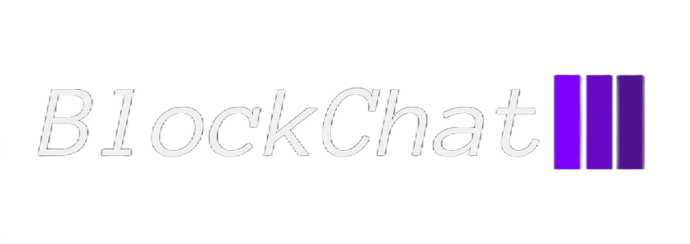

# BlockChat - NTUA Blockchain Project 2023-24



**BlockChat** is a university project developed at the National Technical University of Athens aimed at creating a simplified blockchain platform. It allows users to engage in secure and reliable cryptocurrency transactions and message exchanges using a dummy Ethereum-like token called BlockChat Coin (BCC).

## Project Overview

BlockChat is dummy-cryptocurrency focusing on transaction handling and block validation using a Proof-of-Stake consensus algorithm. Users can perform secure transactions and message exchanges within a decentralized and distributed environment without the need for a central authority.

## Features

- **BlockChat Wallet**: Each user has a wallet containing BCCs necessary for making transactions and sending messages.
- **Transactions**: Users can send BCCs or messages to other wallets. Transactions incur a fee, calculated as a percentage of the transaction amount for currency transfers or based on message length.
- **Consensus Mechanism**: Utilizes a Proof-of-Stake algorithm to validate transactions and form new blocks.

## Getting Started

### Prerequisites
`pip install requirements.txt`

### Installation and Setup

1. **Configure Network Settings**:
   - Edit `./src/.env` to set the `BOOTSTRAP_IP` and `BOOTSTRAP_PORT`.
   - Adjust the prefix for private IPs in the network in [`wserve.py line 23`](https://github.com/ntua-el19019/ntua-blockchain/blob/main/src/wserve.py#L23).

2. **Starting the Application**:
   - Open a terminal for each node and navigate to the project directory.
   - Run the following command to start the BlockChat client:
     ```
     bash entrypoint.sh TOTAL_NODES BLOCK_CAPACITY
     ```
   - Replace `TOTAL_NODES` with the number of client nodes, and `BLOCK_CAPACITY` with the desired transactions per block capacity.

3. **Run Tests**:
   - Execute the test script to simulate network operations:
     ```
     bash test_entrypoint.sh TOTAL_NODES BLOCK_CAPACITY [COMPUTE_JUSTICE]
     ```
   - The `COMPUTE_JUSTICE` parameter (optional) influences initial staking amounts, with a default setting of `False`.


### Example of Usage


### Docker Support
- For containerized setup, please refer to the Docker branch and follow the provided instructions.

## License

BlockChat is released under the MIT License. For more details, see the LICENSE file in this repository.
